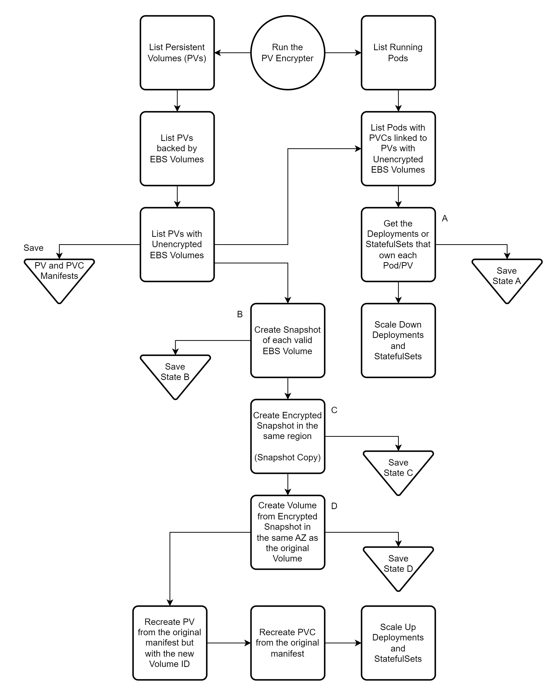

# EKS Persistent Volume Encrypter

##  What is it?

A tool to detect Persistent Volumes (PVs) in your EKS cluster that are backed by
unencrypted EBS Volumes and encrypt them.

## Do I need it?

If you:

➡️ Have an EKS Cluster.  
➡️ Use Persistent Volumes backed by EBS Volumes.  
➡️ Want to make sure all the EBS Volumes you use are encrypted.  
➡️ Don't want to do it one-by-one.  

Then this tool will help you speed up this process.

## What does it contain?

* A Jupyter Notebook which is the main interface.
* A simple CLI that displays relevant information about your cluster.

The CLI will be limited to read-only actions. The Notebook is the only way to execute
constructive/destructive actions.

## Installation

Hosted on [PyPi](https://pypi.org/project/eks-pv-encrypter/).

`pip install eks-pv-encrypter`

## Usage

1. Use the `pv_encrypter.ipynb` Notebook.
2. If you want a read-only overview of your Cluster. Just run `pv-encrypter status`. 

## Overview of the Process

